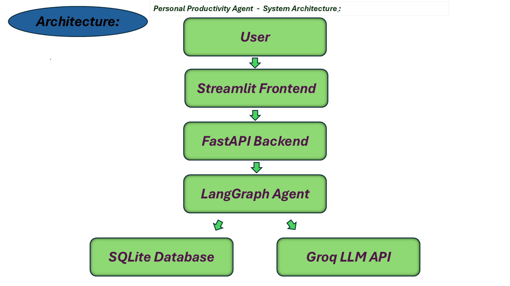
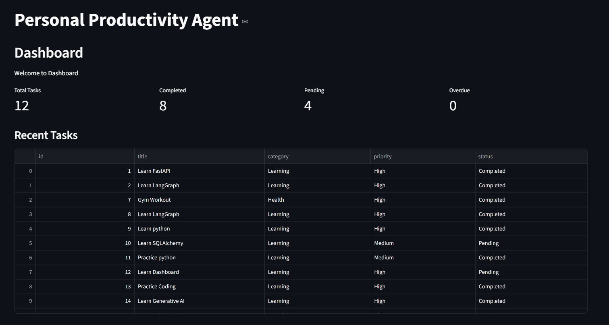
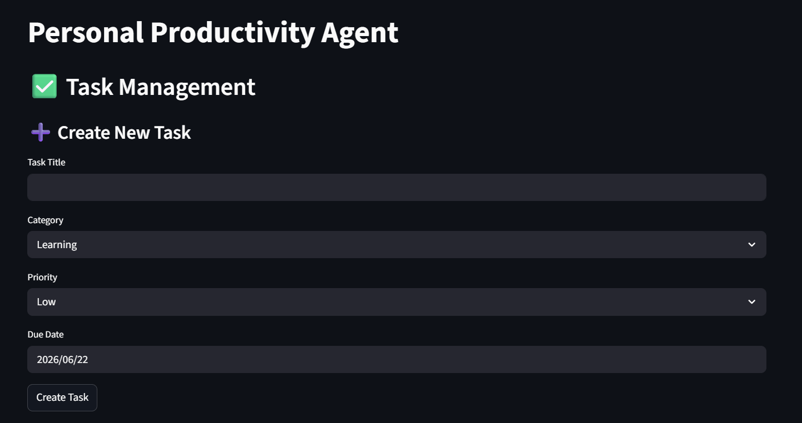
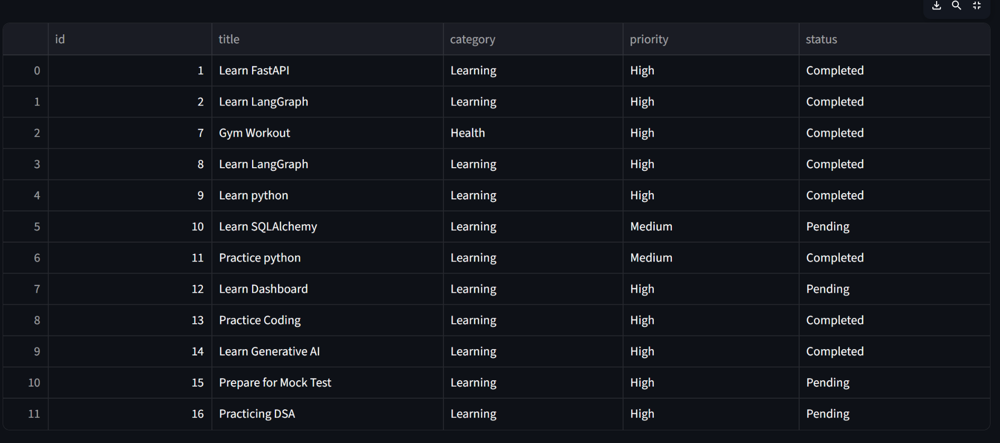
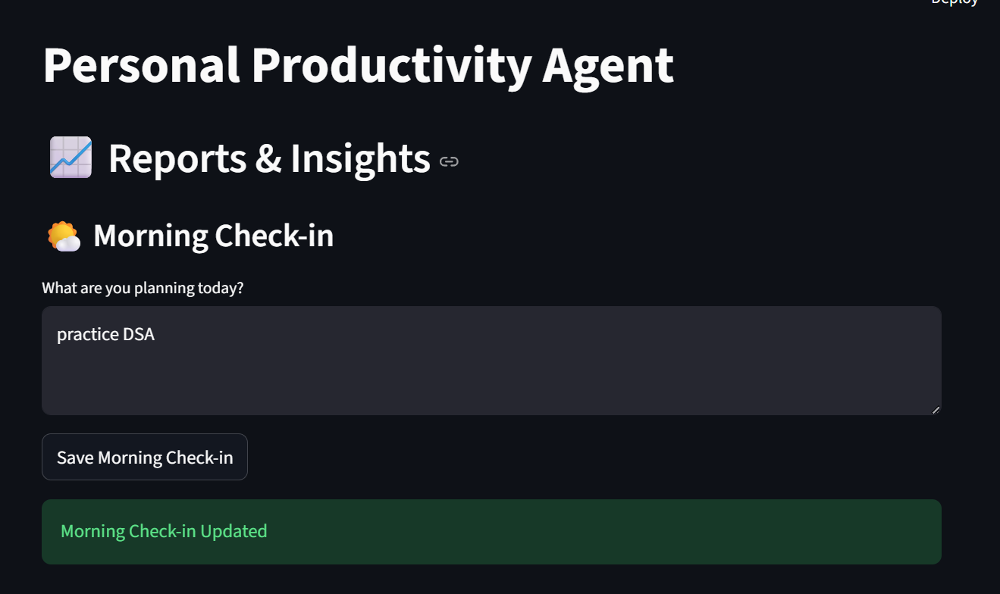
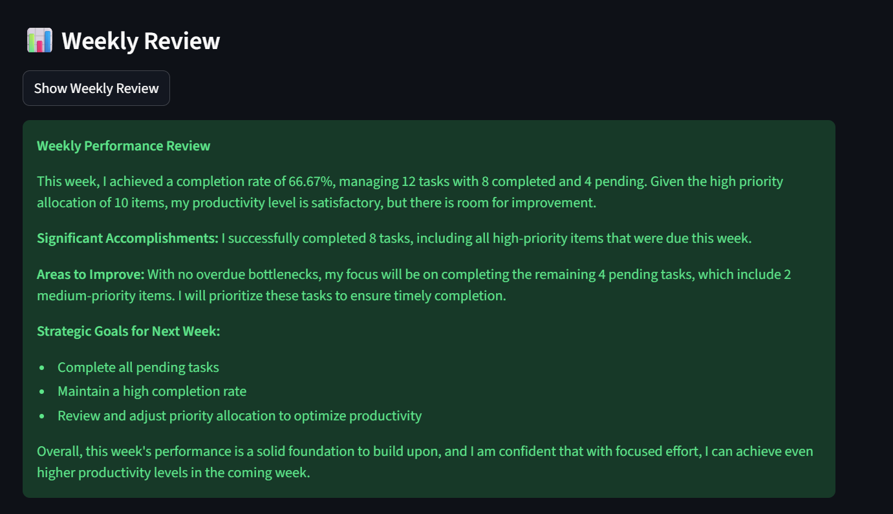
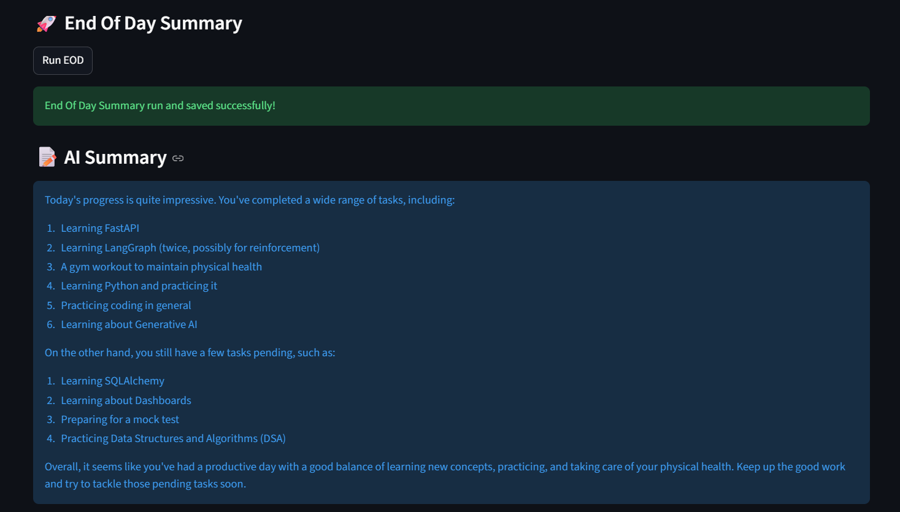
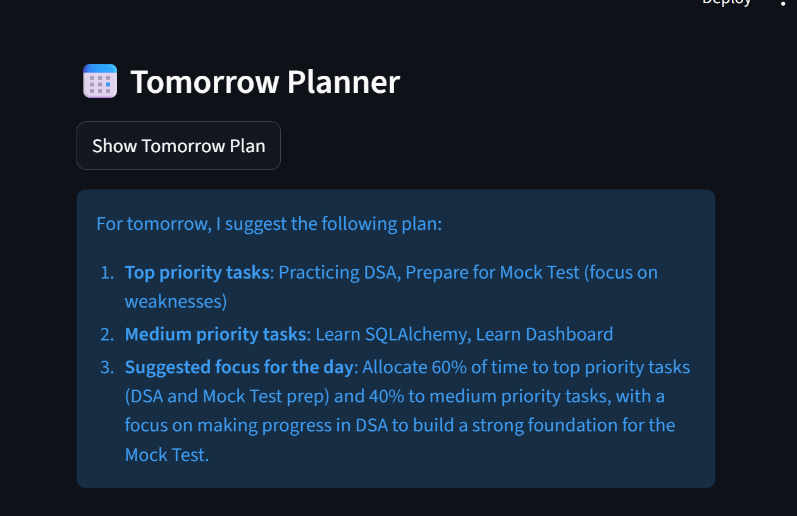

# Personal Productivity Agent

## Overview
A productivity management system built using FastAPI, Streamlit, SQLite, and SQLAlchemy.

## Features
- TASK MANAGEMENT
- Create Tasks
- View Tasks
- Complete Tasks
- Morning Check-in
- Evening Check-in
- Overdue Tasks
- End Of Day Summary
- Tomorrow Planner
- Weekly Review
- Dashboard Analytics

## Tech Stack
- Pandas

Programming Language:
- Python

Frontend:
- Streamlit

Backend:
- FastAPI

Database:
- SQLite
- SQLAlchemy

## Architecture Diagram

## Architecture Explanation
1. User interacts with the Streamlit frontend.
2. Streamlit sends requests to FastAPI APIs.
3. FastAPI manages task operations and business logic.
4. LangGraph Agent processes productivity workflows.
5. SQLite stores tasks, logs, and summaries.
6. Groq LLM generates summaries, plans, and reviews.

## Install Dependencies
pip install -r requirements.txt

## Run Backend
uvicorn backend.main:app --reload

## Run Frontend
streamlit run frontend/app.py

## Screenshots
### Dashboard

### Create Task

### Task Management

### Morning Check-in

### Weekly Review

### End Of Day Summary

### Tomorrow Planner

## Future Improvements
- User Authentication with JWT Login
- Multiple User Support
- Email Reminders for Overdue Tasks
- Voice-based Morning Check-ins
- Google Calendar Integration
- Advanced Weekly Analytics
- Streak Tracking and Productivity Score
- Cloud Deployment with PostgreSQL
- Real-time Notifications
- Mobile-friendly UI

## Features
| Feature            | Status |
|---------------------|-------|
| Create Tasks        | ✅ |
| Complete Tasks      | ✅ |
| Delete Tasks        | ✅ |
| Morning Check-in    | ✅ |
| Evening Check-in    | ✅ |
| Overdue Detection   | ✅ |
| End Of Day Summary  | ✅ |
| Tomorrow Planner    | ✅ |
| Weekly Review       | ✅ |
| Dashboard Analytics | ✅ |
| LangGraph Agent     | ✅ |

### Clone Repository
git clone https://github.com/murali002K/Personal-Productivity-Agent.git

